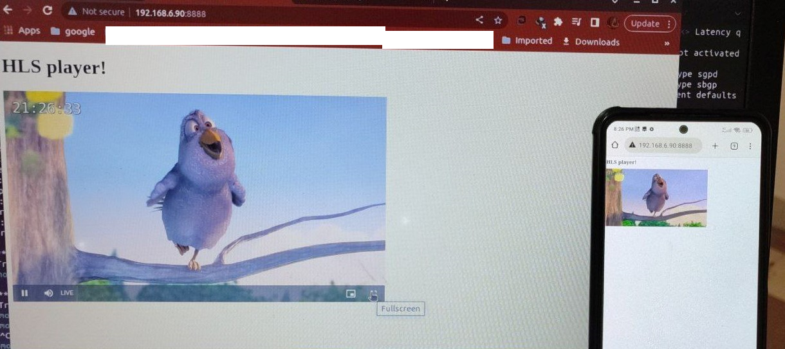

# GStreamer-HLS-Live-Video-Streaming
GStreamer provides a comprehensive set of tools and libraries that enable us to handle various multimedia formats and codecs, as well as manage multimedia pipelines with ease. With GStreamer, we can create complex multimedia applications that incorporate video and audio streams, apply real-time effects and filters, and implement advanced features such as network streaming and synchronization.

## Install GStreamer
```bash
	$ sudo apt update
	$ sudo apt-get install libgstreamer1.0-dev libgstreamer-plugins-base1.0-dev 
	$ sudo apt-get install libgstreamer-plugins-bad1.0-dev gstreamer1.0-plugins-base gstreamer1.0-plugins-good
	$ sudo apt-get install gstreamer1.0-plugins-bad gstreamer1.0-plugins-ugly gstreamer1.0-libav gstreamer1.0-tools 
    $ sudo apt-get install gstreamer1.0-x gstreamer1.0-alsa gstreamer1.0-gl gstreamer1.0-gtk3 gstreamer1.0-qt5 gstreamer1.0-pulseaudio
```

Once all the necessary libraries and plugins are installed, we can begin developing our multimedia applications using GStreamer. By having all the required components installed, we can ensure that our applications run smoothly and efficiently.

Therefore, it is important to have these libraries and plugins installed and configured properly on our system before proceeding with our multimedia development tasks.

To be able to use pkg-config, we must first install it on our system. pkg-config is a useful tool that enables us to retrieve information about installed libraries and their dependencies, which is essential for compiling and linking programs that use these libraries.

To install pkg-config, we use the appropriate installation command for our operating system. In this case, since we are using Ubuntu, we can use the apt package manager to download and install pkg-config. This can be done easily using the following command:
```bash
	$ sudo apt install pkg-config
```

## Stream video C Code
```C
#include <gst/gst.h>
	
	int tutorial_main(int argc, char *argv[]) {
		GstElement *pipeline;
		GstBus *bus;
		GstMessage *msg;
		
		/* Initialize GStreamer */
		gst_init(&argc, &argv);
		
		/* Build the pipeline */                         //Edit the filesrc location and playlist-location and also replace your IP & Port
		pipeline = gst_parse_launch(
		"filesrc location=/path/to/test_video.mp4 ! qtdemux name=demux "
		"demux. ! queue ! decodebin ! videoconvert ! clockoverlay ! x264enc tune=zerolatency ! h264parse ! queue ! mux. "
		"demux. ! queue ! decodebin ! audioconvert ! audioresample ! audio/x-raw,channels=2 ! voaacenc bitrate=128000 ! aacparse ! queue ! mux. "
		"mpegtsmux name=mux ! hlssink playlist-root=http://192.168.6.90:8888 playlist-location=play.m3u8 location=/path/to/segment_%05d.ts target-duration=1 max-files=10",
		NULL);
		
		
		/* Start playing */
		gst_element_set_state(pipeline, GST_STATE_PLAYING);
		
		/* Wait until error or EOS */
		bus = gst_element_get_bus(pipeline);
		msg = gst_bus_timed_pop_filtered(bus, GST_CLOCK_TIME_NONE,
		GST_MESSAGE_ERROR | GST_MESSAGE_EOS);
		
		/* Error handling */
		if (GST_MESSAGE_TYPE(msg) == GST_MESSAGE_ERROR) {
			GError *err = NULL;
			gchar *debug_info = NULL;
			gst_message_parse_error(msg, &err, &debug_info);
			g_printerr("Error received from element %s: %s\n", GST_OBJECT_NAME(msg->src), err->message);
			g_printerr("Debugging information: %s\n", debug_info ? debug_info : "none");
			g_clear_error(&err);
			g_free(debug_info);
		}
		
		/* Free resources */
		gst_message_unref(msg);
		gst_object_unref(bus);
		gst_element_set_state(pipeline, GST_STATE_NULL);
		gst_object_unref(pipeline);
		return 0;
	}
	
	int main(int argc, char *argv[]) {
		return tutorial_main(argc, argv);
	}
```
## CMake and run
To compile `playvideo.c` with the `gstreamer-1.0` library, we can use the CMake build system:

1. Create a new file called `CMakeLists.txt` in the same directory as `playvideo.c`. Add the following contents to the file:
```CMAKE
cmake_minimum_required(VERSION 3.2)
project(playvideo)

find_package(PkgConfig REQUIRED)
pkg_check_modules(GST REQUIRED gstreamer-1.0)

add_executable(playvideo playvideo.c)
target_include_directories(playvideo PUBLIC ${GST_INCLUDE_DIRS})
target_link_libraries(playvideo ${GST_LIBRARIES})
set_target_properties(playvideo PROPERTIES RUNTIME_OUTPUT_DIRECTORY ${CMAKE_SOURCE_DIR})
```


2. Open a terminal and navigate to the directory containing `playvideo.c` and `CMakeLists.txt`.

3. Create a build directory and navigate into it:
```bash
	$  mkdir build
	$‌  cd build
	$  cmake ..
	$  make
```
This will compile playvideo.c and link it with the gstreamer-1.0 library to produce an executable called playvideo in the main direcotry. All the code is in the CMake directory.

Then, we can serve the directory with the following command:
```bash
	$  python3 -m http.server 8888
```
After that, we can run the file with the command:
```bash
	$  ./playvideo
```
Finally, we can open a web browser in both the Ubuntu system and phone browser connected to the same network, and go to 192.168.6.90:8888 to view the video.
All the code is in the playvideo directory.	

<a target="blank"></a>
